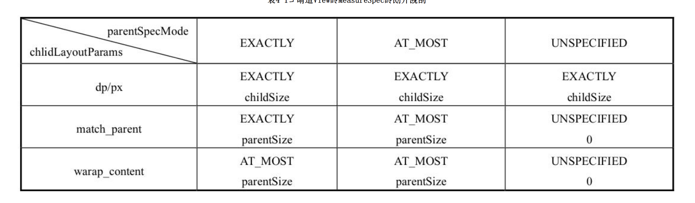

# View的绘制流程

# 一. ViewRootImpl的performTraversals做了什么

### 1. performMeasure

### 2. performLayout

### 3. performDraw

# 二. MeasureSpec

MeasureSpec代表一个32位int值，高2位代表SpecMode，低30位代表SpecSize，SpecMode是指测量模式，而SpecSize是指在某种测量模式下的规格大小。

MeasureSpec通过将SpecMode和SpecSize打包成一个int值来避免过多的对象内存分配，为了方便操作，其提供了打包和解包方法。

可以通过makeMeasureSpec来主动进行测量。

### 1. SpecModel

* UNSPECIFIED 父容器不对View有任何限制，要多大给多大，这种情况一般用于系统内部，表示一种测量的状态。
 
* EXACTLY 父容器已经检测出View所需要的精确大小，这个时候View的最终大小就是SpecSize所指定的值。它对应于LayoutParams中的match_parent和具体的数值这两种模式。

* AT_MOST 父容器指定了一个可用大小即SpecSize，View的大小不能大于这个值，具体是什么值要看不同View的具体实现。它对应于LayoutParams中的wrap_content。

### 2. MeasureSpec和LayoutParams的对应关系

一个View的MeasureSpec不是唯一由LayoutParams决定的，LayoutParams需要和父容器一起才能决定View的MeasureSpec，从而进一步决定View的宽/高。

另外，对于顶级View（即DecorView）和普通View来说，MeasureSpec的转换过程略有不同。对于DecorView，其MeasureSpec由窗口的尺寸和其自身的LayoutParams来共同确定；对于普通View，其MeasureSpec由父容器的
MeasureSpec和自身的LayoutParams来共同决定，MeasureSpec一旦确定后，onMeasure中就可以确定View的测量宽/高。

### 3. DecorView的MeasureSpec

* ViewRootImpl的measureHierarchy 

desiredWindowWidth和desiredWindowHeight都是Window的宽度。

``` java
childWidthMeasureSpec = getRootMeasureSpec(desiredWindowWidth,lp.width);
childHeightMeasureSpec = getRootMeasureSpec(desiredWindowHeight,lp.
height);
performMeasure(childWidthMeasureSpec,childHeightMeasureSpec);
```

* getRootMeasureSpec获得MeasureSpec

可以看到，DecorView是根据自身的LayoutParams来决定的。

### 4. 普通View的MeasureSpec

普通View的绘制由ViewGroup传递而来，看下measureChildWithMargins：

```
    protected void measureChildWithMargins(View child,
            int parentWidthMeasureSpec, int widthUsed,
            int parentHeightMeasureSpec, int heightUsed) {
        final MarginLayoutParams lp = (MarginLayoutParams) child.getLayoutParams();

        final int childWidthMeasureSpec = getChildMeasureSpec(parentWidthMeasureSpec,
                mPaddingLeft + mPaddingRight + lp.leftMargin + lp.rightMargin
                        + widthUsed, lp.width);
        final int childHeightMeasureSpec = getChildMeasureSpec(parentHeightMeasureSpec,
                mPaddingTop + mPaddingBottom + lp.topMargin + lp.bottomMargin
                        + heightUsed, lp.height);

        child.measure(childWidthMeasureSpec, childHeightMeasureSpec);
    }
```

子元素的
MeasureSpec的创建与父容器的MeasureSpec和子元素本身的LayoutParams有关，此外还和View的margin及padding有关。

```
    public static int getChildMeasureSpec(int spec, int padding, int childDimension) {
        int specMode = MeasureSpec.getMode(spec);
        int specSize = MeasureSpec.getSize(spec);

        int size = Math.max(0, specSize - padding);

        int resultSize = 0;
        int resultMode = 0;

        switch (specMode) {
        // Parent has imposed an exact size on us
        case MeasureSpec.EXACTLY:
            if (childDimension >= 0) {
                resultSize = childDimension;
                resultMode = MeasureSpec.EXACTLY;
            } else if (childDimension == LayoutParams.MATCH_PARENT) {
                // Child wants to be our size. So be it.
                resultSize = size;
                resultMode = MeasureSpec.EXACTLY;
            } else if (childDimension == LayoutParams.WRAP_CONTENT) {
                // Child wants to determine its own size. It can't be
                // bigger than us.
                resultSize = size;
                resultMode = MeasureSpec.AT_MOST;
            }
            break;

        // Parent has imposed a maximum size on us
        case MeasureSpec.AT_MOST:
            if (childDimension >= 0) {
                // Child wants a specific size... so be it
                resultSize = childDimension;
                resultMode = MeasureSpec.EXACTLY;
            } else if (childDimension == LayoutParams.MATCH_PARENT) {
                // Child wants to be our size, but our size is not fixed.
                // Constrain child to not be bigger than us.
                resultSize = size;
                resultMode = MeasureSpec.AT_MOST;
            } else if (childDimension == LayoutParams.WRAP_CONTENT) {
                // Child wants to determine its own size. It can't be
                // bigger than us.
                resultSize = size;
                resultMode = MeasureSpec.AT_MOST;
            }
            break;

        // Parent asked to see how big we want to be
        case MeasureSpec.UNSPECIFIED:
            if (childDimension >= 0) {
                // Child wants a specific size... let him have it
                resultSize = childDimension;
                resultMode = MeasureSpec.EXACTLY;
            } else if (childDimension == LayoutParams.MATCH_PARENT) {
                // Child wants to be our size... find out how big it should
                // be
                resultSize = View.sUseZeroUnspecifiedMeasureSpec ? 0 : size;
                resultMode = MeasureSpec.UNSPECIFIED;
            } else if (childDimension == LayoutParams.WRAP_CONTENT) {
                // Child wants to determine its own size.... find out how
                // big it should be
                resultSize = View.sUseZeroUnspecifiedMeasureSpec ? 0 : size;
                resultMode = MeasureSpec.UNSPECIFIED;
            }
            break;
        }
        //noinspection ResourceType
        return MeasureSpec.makeMeasureSpec(resultSize, resultMode);
    }
```


根据父容器的MeasureSpec同时结合View本身的LayoutParams来确定子元素的MeasureSpec，参数中的padding是指父容器中已占用的空
间大小，因此子元素可用的大小为父容器的尺寸减去padding。

普通View的MeasureSpec的结果如下：



# 三. Measure

### 1. View的measure过程

* view的measure

* onMeasure

```
    protected void onMeasure(int widthMeasureSpec, int heightMeasureSpec) {
        setMeasuredDimension(getDefaultSize(getSuggestedMinimumWidth(), widthMeasureSpec),
                getDefaultSize(getSuggestedMinimumHeight(), heightMeasureSpec));
    }
```

```
    public static int getDefaultSize(int size, int measureSpec) {
        int result = size;
        int specMode = MeasureSpec.getMode(measureSpec);
        int specSize = MeasureSpec.getSize(measureSpec);

        switch (specMode) {
        case MeasureSpec.UNSPECIFIED:
            result = size;
            break;
        case MeasureSpec.AT_MOST:
        case MeasureSpec.EXACTLY:
            result = specSize;
            break;
        }
        return result;
    }
```

可以看出，getDefaultSize这个方法的逻辑很简单，对于我们来说，我们只需要看AT_MOST和.EXACTLY这两种情况。简单地理解，其实getDefaultSize返回的大小就是
measureSpec中的specSize，也就是父容器的可用大小。

* 重写onMeasure

从getDefaultSize方法的实现来看，View的宽/高由specSize决定，所以我们可以得出如下结论：直接继承View的自定义控件需要重写onMeasure方法并设置wrap_content时的自
身大小，否则在布局中使用wrap_content就相当于使用match_parent。

为什么呢？这个原因需要结合上述代码和表4-1才能更好地理解。从上述代码中我们知道，如果View在布
局中使用wrap_content，那么它的specMode是AT_MOST模式，在这种模式下，它的宽/高等于specSize；查表4-1可知，这种情况下View的specSize是parentSize，而parentSize是父
容器中目前可以使用的大小，也就是父容器当前剩余的空间大小。

很显然，View的宽/高就等于父容器当前剩余的空间大小，这种效果和在布局中使用match_parent完全一致。

### 2. ViewGroup的measure过程

对于ViewGroup来说，除了完成自己的measure过程以外，还会遍历去调用所有子元素的measure方法，各个子元素再递归去执行这个过程。和View不同的是，ViewGroup是
一个抽象类，因此它没有重写View的onMeasure方法，但是它提供了一个叫measureChildren的方法。

ViewGroup并没有定义其测量的具体过程，这是因为ViewGroup是一个抽象类，其测量过程的onMeasure方法需要各个子类去具体实现，比如LinearLayout、
RelativeLayout等，为什么ViewGroup不像View一样对其onMeasure方法做统一的实现呢？那是因为不同的ViewGroup子类有不同的布局特性，这导致它们的测量细节各不相同，
比如LinearLayout和RelativeLayout这两者的布局特性显然不同，因此ViewGroup无法做统一实现。

# 四. Layout

Layout的作用是ViewGroup用来确定子元素的位置，当ViewGroup的位置被确定后，它在onLayout中会遍历所有的子元素并调用其layout方法。

layout方法确定View本身的位置，而onLayout方法则会确定所有子元素的位置。

### 1. View的Layout

layout方法的大致流程如下：首先会通过setFrame方法来设定View的四个顶点的位置，即初始化mLeft、mRight、mTop和mBottom这四个值，View的四个顶点一旦确定，那么
View在父容器中的位置也就确定了；接着会调用onLayout方法，这个方法的用途是父容器确定子元素的位置，和onMeasure方法类似，onLayout的具体实现同样和具体的布局有
关，所以View和ViewGroup均没有真正实现onLayout方法。

### 2. LinearLayout的Layout


* setChildFrame

* 子view的layout

### 3. View的测量宽/高和最终/宽高有什么区别？

也就是View的getMeasuredWidth和getWidth这两个方法有什么区别。

从getWidth和getHeight的源码再结合mLeft、mRight、mTop和mBottom这四个变量的赋值过程来看，getWidth方法的返回值刚好就是View的测量宽度，而getHeight方法的返回
值也刚好就是View的测量高度。

经过上述分析，现在我们可以回答这个问题了：在View的默认实现中，View的测量宽/高和最终宽/高是相等的，只不过测量宽/高形成于View
的measure过程，而最终宽/高形成于View的layout过程，即两者的赋值时机不同，测量宽/高的赋值时机稍微早一些。

# 五. Draw

### 1. Draw的流程

Draw过程就比较简单了，它的作用是将View绘制到屏幕上面。View的绘制过程遵循如下几步：

* 绘制背景background.draw(canvas)。
* 绘制自己（onDraw）。
* 绘制children（dispatchDraw）。
* 绘制装饰（onDrawScrollBars）。